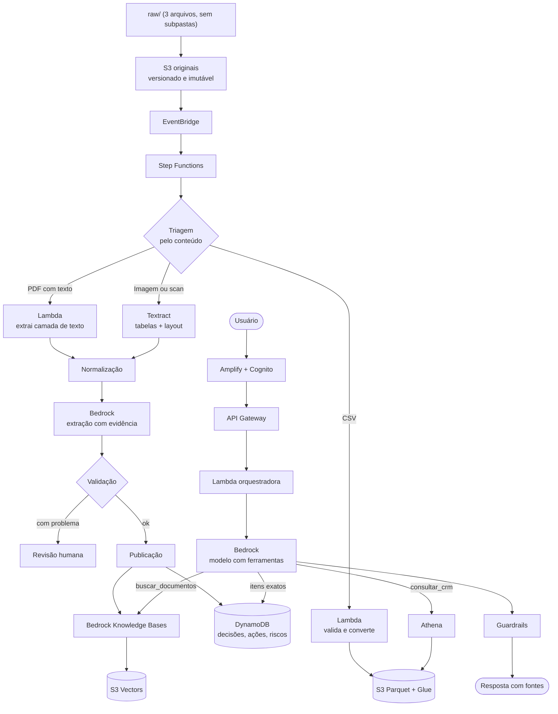

# Wiki Inteligente de Documentos Corporativos na AWS

Proposta de arquitetura para o Desafio de Projeto **"A Wiki Perdida dos Arquivos Corporativos"** (DIO, Bootcamp Nublify).

A solução transforma três arquivos brutos e sem organização em uma base que responde perguntas em linguagem natural e cita o documento de onde tirou cada informação, usando apenas serviços da AWS.

> **Situação do projeto:** esta é uma proposta de arquitetura. Nada foi implantado na AWS; o repositório traz apenas um script para testar a rota de OCR. A resposta completa, Quest por Quest, está em [`resposta.md`](resposta.md). Os arquivos originais estão em [`raw/`](raw/) e não foram alterados.

---

## O problema

A empresa fictícia Vendas S.A. registrou decisões e resultados comerciais em formatos diferentes, todos soltos em uma pasta só. Para responder "qual foi a decisão sobre a campanha X?" ou "quem ficou responsável pela ação Y?", alguém precisa abrir arquivo por arquivo.

O acervo tem três arquivos, e nenhum se parece com o outro:

| Arquivo | O que é | Particularidade |
|---|---|---|
| `ata_reuniao_vendas_sa.pdf` | Ata de 08/07/2026, 5 páginas | Já tem texto dentro. Quase tudo está em tabelas, e uma delas quebra entre duas páginas |
| `ata_resultados_vendas_novos_dados.png` | Ata de 15/01/2026, uma folha digitalizada | É só imagem. Tem uma tabela, duas anotações à mão e um carimbo |
| `vendas_sa_dados_ficticios_laboratorio.csv` | 240 oportunidades do CRM, 19 colunas | Não é texto corrido. As perguntas sobre ele são de contagem e soma |

Tratar os três do mesmo jeito não funciona. Mandar o PDF para OCR é pagar para piorar um texto que já está correto. Ler o PNG como texto não devolve nada. Indexar o CSV para busca por semelhança devolve algumas linhas parecidas, quando a pergunta pedia a soma de todas.

---

## Como a arquitetura funciona



**Do arquivo bruto até a resposta**

1. **Entrada.** Os arquivos sobem para um bucket S3 exclusivo dos originais, com versionamento e bloqueio de alteração. Nenhuma etapa de processamento tem permissão de escrita nele.
2. **Triagem.** Uma função identifica o tipo real pelos primeiros bytes (e não pela extensão) e, no PDF, verifica se cada página tem texto. A classificação é gravada como metadado, já que não há subpastas.
3. **Extração por rota.** Cada formato segue seu caminho (detalhes na seção abaixo).
4. **Normalização.** Cabeçalhos e rodapés repetidos são removidos, tabelas cortadas entre páginas são unidas, datas e valores são padronizados.
5. **Enriquecimento.** Um modelo no Bedrock extrai participantes, decisões, ações, riscos e resumo. Cada item precisa vir com a frase literal que o sustenta, e uma função confere se essa frase existe no texto.
6. **Indexação.** Cada seção da ata vira um trecho com metadados (data, tipo, página, confidencialidade). O Bedrock Knowledge Bases gera os embeddings e grava no S3 Vectors.
7. **Pergunta.** O usuário faz login e pergunta. O modelo decide se busca nas atas, consulta o CRM por SQL, ou ambos.
8. **Resposta.** O modelo responde apenas com o material recuperado e cita arquivo, seção e página. Se a base não tem a informação, a Wiki diz isso.

---

## Como cada formato é tratado

### PDF com texto: sem OCR

A triagem confirma que as 5 páginas têm texto extraível. Uma Lambda lê a camada de texto diretamente, preservando acentos e valores exatos. A reconstrução das tabelas fica com o modelo de linguagem, que trabalha sobre texto limpo. A seção final do PDF declara os totais (6 participantes, 5 decisões, 6 ações), e esses números são usados para conferir a extração.

### Imagem digitalizada: Amazon Textract

Sem OCR, nada dessa ata entra na base. O Textract é chamado com dois recursos:

- **Tabelas**, porque os indicadores estão em uma tabela. Só com detecção de texto, "R$ 9,85 mi" perderia a ligação com "Faturamento".
- **Layout**, para identificar título e seções e dividir a ata por elas.

O Textract também informa se cada palavra é impressa ou manuscrita, e com que confiança foi lida. As anotações "conferir CRM" e "ação prioritária" ficam em campo separado. Os prazos 28/02/2026 e 12/02/2026, parcialmente cobertos por uma anotação e pelo círculo em volta dela, tendem a sair com confiança baixa e vão para revisão humana antes de serem publicados.

### CSV: tabela consultada por SQL

O CSV é validado, convertido para Parquet e registrado no Glue Data Catalog. As perguntas sobre ele são respondidas pelo Athena: o modelo traduz a pergunta em um `SELECT`, que é validado antes de rodar (somente leitura, somente essa tabela). Na busca semântica entra apenas uma ficha descrevendo o conjunto de dados e alguns resumos, para a Wiki saber que essa fonte existe.

---

## Serviços escolhidos e por quê

| Serviço | Por que ele |
|---|---|
| **Amazon S3** | Armazenamento durável e barato. Versionamento e Object Lock garantem que o original não muda |
| **AWS Step Functions** | O fluxo tem três rotas, esperas e novas tentativas. Ele mostra cada execução passo a passo, o que Lambdas encadeadas esconderiam |
| **AWS Lambda** | Cada etapa é curta e roda sob demanda. Sem arquivo novo, sem custo |
| **Amazon Textract** | Parte do acervo é imagem. Além do texto, entrega a estrutura de tabelas, separa impresso de manuscrito e informa a confiança |
| **Amazon Bedrock** | Modelos de linguagem dentro da AWS, sem serviço externo. Usado para extrair dados das atas, gerar embeddings, escrever SQL e redigir respostas |
| **Bedrock Knowledge Bases** | Gera e sincroniza os embeddings a partir do S3 e faz a busca com filtro por metadados, sem código próprio para isso |
| **Amazon S3 Vectors** | Base vetorial sem custo mínimo por hora, adequada a um acervo pequeno. A contrapartida é não ter busca por palavra-chave |
| **Amazon DynamoDB** | Decisões e ações ficam como registros. "O que está com o Rafael Nunes?" vira uma consulta exata |
| **Glue Data Catalog + Athena** | Somar e contar é trabalho de SQL. O Athena cobra por consulta e não exige banco ligado |
| **Bedrock Guardrails** | Bloqueia respostas que não estão sustentadas pelas fontes |
| **Cognito + API Gateway + Amplify** | Login com grupos, API protegida e site estático, tudo sem servidor |
| **IAM, KMS, CloudTrail, Macie** | Privilégio mínimo, criptografia, trilha de auditoria e detecção de dados pessoais |
| **CloudWatch, SQS, SNS, Budgets** | Logs, alarmes, fila para reprocessar falhas e alerta de custo |

A região proposta é `us-east-1`, porque o Textract não tem endpoint em São Paulo.

---

## Exemplos de uso

As respostas abaixo são as **esperadas**, montadas a partir da leitura dos três arquivos. Os números do CRM foram calculados localmente sobre o CSV. A solução não foi executada na AWS.

**Pergunta sobre uma ata**

> Quem ficou responsável por definir as contas-alvo da campanha Rota 120, e qual o prazo?

Camila Rocha, com prazo em 20/07/2026 (ação A-003, prioridade alta, status "Em preparação").
*Fonte: `ata_reuniao_vendas_sa.pdf`, seção 7, p. 3, reunião de 08/07/2026.*

**Pergunta que precisa da ata e do CRM**

> A campanha Rota 120 atingiu a meta de pipeline?

A meta aprovada foi gerar R$ 6.000.000 em pipeline qualificado até 30/09/2026. No CRM há 96 oportunidades da campanha, criadas entre 01/07 e 30/09/2026, somando R$ 12.067.600,00 em valor bruto: 31 ganhas (R$ 3.838.300,00), 20 perdidas (R$ 2.600.100,00) e 45 em aberto (R$ 5.629.200,00). O CRM não marca quais oportunidades são "qualificadas", então a comparação considera todas.
*Fontes: `ata_reuniao_vendas_sa.pdf`, seção 5.4, p. 3; `vendas_sa_dados_ficticios_laboratorio.csv`, filtro `campanha = 'Rota 120'`, 96 linhas.*

**Pergunta de agregação**

> Quais foram os principais motivos de perda?

Das 46 oportunidades perdidas: Preço, 15 (32,6%); Prioridade adiada, 11 (23,9%); Concorrente escolhido, 9 (19,6%); Sem orçamento, 5; Baixa aderência, 4; Sem retorno, 2.
*Fonte: `vendas_sa_dados_ficticios_laboratorio.csv`, filtro `status = 'Perdida'`, 46 linhas.*

**Pergunta sobre trecho de baixa confiança**

> Qual o prazo para expandir a equipe de vendas do Norte?

28/02/2026, sob responsabilidade de Paulo Mendes. Atenção: este trecho vem de um documento digitalizado e há uma anotação manuscrita sobre a data. Confira o original.
*Fonte: `ata_resultados_vendas_novos_dados.png`, seção 5, reunião de 15/01/2026.*

**Pergunta sem resposta na base**

> Qual foi o orçamento aprovado para contratação de fornecedores?

Não encontrei essa informação nos documentos indexados.

---

## Evidência da rota de OCR

O script [`scripts/analisar_ata_textract.py`](scripts/analisar_ata_textract.py) executa no Amazon Textract a chamada proposta para a ata digitalizada (`AnalyzeDocument` com tabelas e layout). Ele gera um relatório com a tabela de indicadores reconstruída, as palavras classificadas como manuscritas, os prazos das deliberações com a confiança de cada data e as linhas abaixo do limite de confiança.

Para rodar no AWS CloudShell, que já tem Python, `boto3` e as credenciais da conta:

```bash
git clone https://github.com/A4thu4/laboratorio-wiki-aws
cd laboratorio-wiki-aws
python3 scripts/analisar_ata_textract.py
```

A execução processa uma página e grava o resultado em uma pasta `evidencias/`, criada na hora. O arquivo em `raw/` é apenas lido. O resultado dessa execução ainda não faz parte do repositório.

---

## O que aprendi

- **Abrir os arquivos antes de escolher serviços.** A extensão diz pouco. Só olhando o conteúdo ficou claro que o PDF é quase todo tabela, que a anotação do PNG cai em cima de dois prazos e que o CSV não tem data de extração.
- **OCR tem custo e tem erro.** Usar o Textract onde já existe texto é pagar para piorar o dado. A triagem por página é o que evita isso.
- **Busca semântica não faz conta.** Dado tabular precisa de SQL. Misturar os dois caminhos em uma única ferramenta daria respostas erradas com aparência de certas.
- **Metadado é o que liga os documentos.** A campanha "Rota 120" aparece em uma decisão da ata e em 96 linhas do CSV, e só um metadado em comum permite cruzar os dois.
- **Rastreabilidade se constrói desde a entrada.** Hash, versão e página precisam ser gravados na ingestão. Não dá para acrescentar a citação depois.
- **Toda escolha tem contrapartida.** O S3 Vectors é o mais barato e não tem busca por palavra-chave. A região com Textract fica fora do Brasil. Registrar essas limitações faz parte da proposta.

---

## Estrutura do repositório

```
.
├── README.md      # este arquivo
├── resposta.md    # proposta completa, pelas 4 Quests
├── scripts/       # script que testa a rota de OCR no Amazon Textract
└── raw/           # documentos originais do desafio, sem alteração
```

---

## Autor

**Arthur Mamedes Borges** - [@A4thu4](https://github.com/A4thu4)
